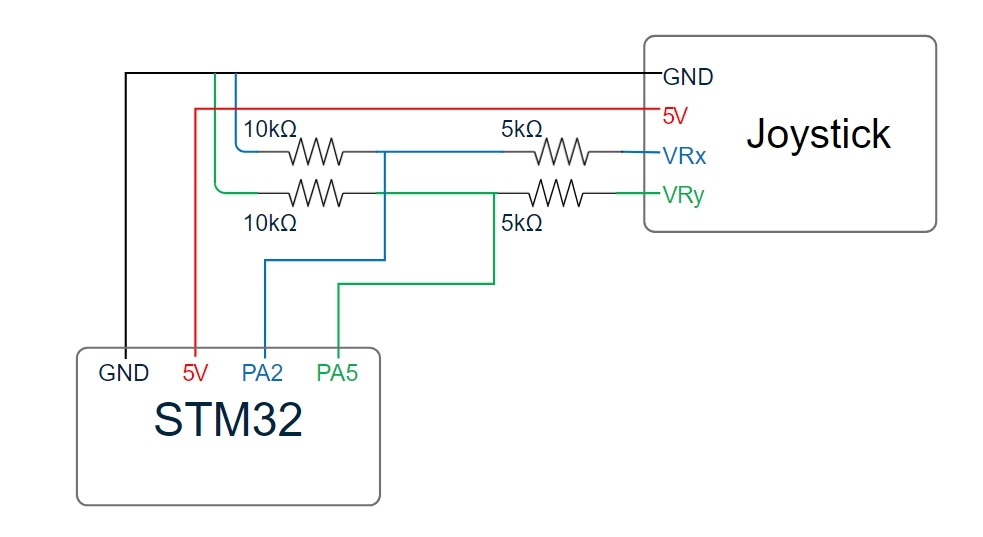

# Snake game on Miosix

This project is part of the Embedded Systems course at the Politecnico of Milan University and consists of creating a terminal game on the STM32F4 board, running the Miosix kernel (official documentation on [the Miosix Page](https://miosix.org/wiki/index.php?title=Main_Page)).
### Flashing the Kernel and the game
After following all the necessary steps of the quick start guide in the official website of Miosix, you should be able to compile the game with the command `make` and  flash the kernel and the program using the command  `st-flash write main.bin 0x08000000`. If everything is correct, you should be able to play the game connecting to the serial port with the 115200 baud rate, note that you can change this in the file "miosix\config\arch\cortexM4_stm32f4\stm32f407vg_stm32f4discovery\board_settings.h" updating the line 

> const unsigned int defaultSerialSpeed=115200;

### HW configuration
The game provides the possibility of using the keyboard or a 4-pin joystick (GND, 5V, x-axis input, y-axis input). To avoid the need of changing the code, the joystick must be connected as follows:
| Joystick     | Board       |
|--------------|-------------|
| GND          | GND pin     |
| 5V           | 5V pin      |
| x-axis Input | PA2 pin     |
| y-axis Input | PA5 pin     |

Furthermore, to avoid having more than 3.3V reaching the board (max input voltage of pins), it could be necessary to make a voltage divider between the joystick outputs and the board inputs, as in the image below in the case of 5V powered joystick:

